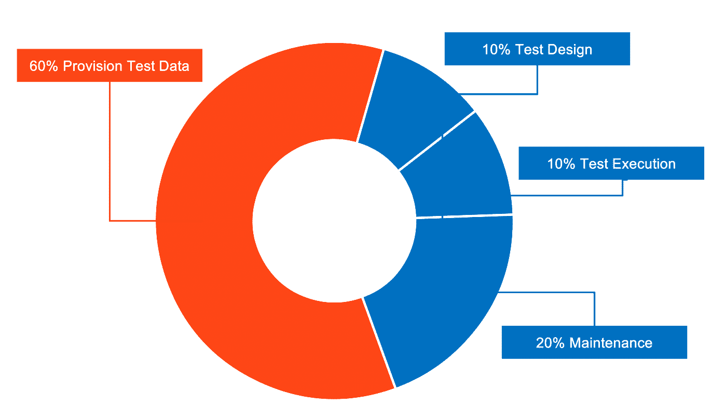

# Data-Driven Testing and Test Data Management

## Introduction to data-driven testing

**Learning objectives**  by the end of this chapter, you will be able to:

1. Understand data-driven testing.
2. Manage test data.
3. Compare the six different data source options available in UiPath:
    - File (Excel/JSON)
    - Generate with Autopilot (AI-powered)
    - Data Service (Automation Cloud)
    - Existing Data (project-based)
    - Auto Generate (path coverage)
    - Test Data Queues (legacy, existing tenants only)
4. Create data-driven test cases using multiple data sources.

Data-driven testing lets you execute a single test case multiple times with different input datasets, instead of creating a separate test case for every scenario.

✅ Test multiple scenarios efficiently

✅ Separate test logic from test data

✅ Easily add new test variations

✅ Achieve better test coverage

!!! note "Prerequisites"
    Orchestrator 2022.4 or later is required to use data-driven testing functionality.

## Test data management

Test data management covers three main steps:

✅ **Designing** the appropriate data for each test scenario

✅ **Provisioning** that data into the environment where tests will run

✅ **Consuming** the data during test execution

This process can consume up to 50% of testing effort. Test data management presents the following challenges:

  

    

      
Manual complexity

      
Preparing datasets by hand is time-consuming and error-prone.

    

  

  

    

      
Specialized knowledge

      
Creating realistic, valid data often requires domain expertise.

    

  

  

    

      
Frequent refreshes

      
Data needs to be updated regularly to stay relevant as systems change.

    

  

  

    

      
Coverage gaps

      
Incorrect or incomplete data can lead to scenarios going untested.

    

  

### Data creation approaches

Three primary strategies exist for creating test data:

  

    

      
Production data

      

        
Use copy of existing production database

        <ul>
          <li>GDPR</li>
          <li>Low coverage</li>
          <li>Outdated</li>
        </ul>
      

    

  

  

    

      
Anonymized production data

      

        
Use anonymized copy of production database

        <ul>
          <li>Complex customization</li>
          <li>Expensive</li>
        </ul>
      

    

  

  

    

      
Synthetic data

      

        
Generate data that mimics production

        <ul>
          <li>High coverage</li>
          <li>Reduced privacy risk</li>
          <li>Easy reproduction</li>
        </ul>
      

    

  

!!! note "Optional topics"
    Generating synthetic test data (using Activities and Autopilot) and Auto Generate for path coverage are not covered in this training.

## Data Driven Test Case

A Data Driven Test Case is a specification of the multiple inputs, execution conditions, testing procedure, and expected results.

### Creating a Data Driven Test Case

To create a Data Driven Test Case, navigate to an already created Test Case and right click. You should now be able to select **Add Test Data**.

## The six data source options

✅ **File** (Excel/JSON) for prepared data

✅ **Generate with Autopilot** using AI capabilities

✅ **Data Service** for consolidated cloud-based management

✅ **Existing Data** from project folders

✅ **Auto Generate** for path coverage optimization

✅ **Test Data Queues** for queue-based data management

!!! note "Test Data Queues not covered in this exercise"
    Test Data Queues are not available for new tenants and are no longer covered as a hands-on exercise here. They remain supported for existing tenants that already use them.

When you create a data-driven test case, the Import Data Variation Source wizard guides you through selecting your preferred data source. The following image showcases the interface where you'll choose and configure your data source option:

### Hands-on Practice

We'll explore four approaches to data-driven test case creation through hands-on exercises. Each tab covers one data source type with step-by-step instructions to complete your exercise.

=== "📊 File (Excel/JSON)"

    File-based data sources let you drive a test case from an Excel spreadsheet or JSON file that you prepare and maintain outside of UiPath.

    !!! example "Exercise 1: Create a data-driven test case using Excel"
        For this exercise, we'll create an `.xlsx` file with the purchase order test data and use it as the data source.

        1. Create an `.xlsx` file with one row per purchase order to check — the PO number and the expected account assignment and location for Line Item 1.
        2. Navigate to an existing test case.
        3. Right-click and select **Add Test Data**.
        4. Choose the `.xlsx` file you created.

=== "🤖 Generate with Autopilot"

    Generate with Autopilot uses AI to create contextually relevant test data directly within Studio, based on a natural language prompt you provide.

    !!! example "Exercise 2: Generate test data by giving instructions in natural language"
        1. Create a new test case containing three arguments: `CountryName`, `CityName`, and `IBAN`.
        2. Access Autopilot and enter this prompt: *"Generate a list of 20 European countries with names typical to the country, cities from the country, and IBANs in the country's format."*
        3. Review and import the generated test data.

=== "☁️ Data Service"

    Data Service (transitioning to the Data Fabric naming) enables centralized entity management, collaboration, and data variation updates without republishing test cases.

    !!! example "Exercise 3: Create a data-driven test case using Data Service"
        
        1. **Create the entity:** in Automation Cloud, open **Data Service** and click **Create New Entity**. Name it `SAPPurchaseOrderData` and save it.
        2. **Add the fields:** in the entity's **Fields** tab, create three **Text** fields — `PONumber`, `ExpectedAccountAssignment`, and `ExpectedLocation`.
        3. **Add the data:** in the entity's **Data** tab, add one record per purchase order you want to check, using the same values as your `.xlsx` file from Exercise 1.
        4. Create a new data-driven test case for the SAP purchase order check (transaction ME23N).
        5. Link it to the `SAPPurchaseOrderData` entity.
        6. Map workflow arguments to the Data Service entity.
        7. Add a Verify activity to compare the displayed account assignment and location against the expected values.
        8. Execute the test case and observe the data variations.

=== "📁 Existing Data"

    **Existing data** is a built-in data source option that allows you to link a test case to an existing JSON or Excel dataset that has already been stored directly inside your project's Test Data folder. This approach separates test logic from execution data, allowing you to run the same automated workflow against multiple variations without manually changing variables.

    !!! example "Exercise 4: Create a data-driven test case using Existing Data"
        1. **Add the data file:** copy the `.xlsx` file you created in Exercise 1 into your project's **Test Data** folder.
        2. **Create a data-driven test case:** in Studio's Project panel, right-click on your workflow or folder, select **Add**, and choose **Data-Driven Test Case**. Provide a descriptive name for your test case.
        3. **Select the data source:** in the configuration window, select **Existing data** from the list of data source types.

## Comparing Data Storage Approaches

Each data source method has distinct advantages and limitations. Choose the approach that best aligns with your project requirements:

  

    

      
📊 Files (Excel/JSON)

      

        
Pros & Cons

        <strong>✅ Pros:</strong>
        <ul>
          <li><strong>Ease of Use:</strong> Excel is widely used and requires little training as it's a familiar tool for most users.</li>
          <li><strong>Readily Available Tool:</strong> No additional systems or licenses needed.</li>
        </ul>
        <strong>⚠️ Cons:</strong>
        <ul>
          <li><strong>Static Nature of Data:</strong> Excel files provide static test data. Any modifications require re-importing the updated file and re-publishing test cases to Orchestrator, which slows down the process and makes it unsustainable for dynamic testing.</li>
          <li><strong>Limited Access Control:</strong> Excel doesn't inherently offer robust access control or security features.</li>
        </ul>
      

    

  

  

    

      
📁 Existing Data 

      

        
Pros & Cons

        <strong>✅ Pros:</strong>
        <ul>
          <li><strong>Ease of Setup and Maintenance:</strong> Using existing data simplifies the setup process as you don't need to generate new data for each test case. You can focus on implementing test cases instead of spending time creating datasets.</li>
        </ul>
        <strong>⚠️ Cons:</strong>
        <ul>
          <li><strong>Data Obsolescence and Maintenance Overhead:</strong> Existing data tends to become outdated quickly. Testers may need to frequently update the test data by manually making changes to files, which can introduce human error and slow down testing cycles.</li>
        </ul>
      

    

  

  

    

      
☁️ Data Service

      

        
Pros & Cons

        <strong>✅ Pros:</strong>
        <ul>
          <li>No-code, seamless, fully integrated</li>
          <li>Secure centralized storage</li>
          <li>Direct Studio integration—no external tools needed</li>
        </ul>
        <strong>⚠️ Cons:</strong>
        <ul>
          <li>Requires initial configuration</li>
          <li>10MB file size limit</li>
        </ul>
      

    

  

## Summary

By completing these exercises, you've learned how to create data-driven test cases using four different data source approaches. This flexibility allows you to choose the method that best fits your project's needs—whether it's Excel files for simplicity, Autopilot for AI-generated data, Data Service for centralized management, or Existing Data for project-based datasets. 

---

[Next → Orchestrator](09-orchestrator.md){: .md-button .md-button--primary}

---
